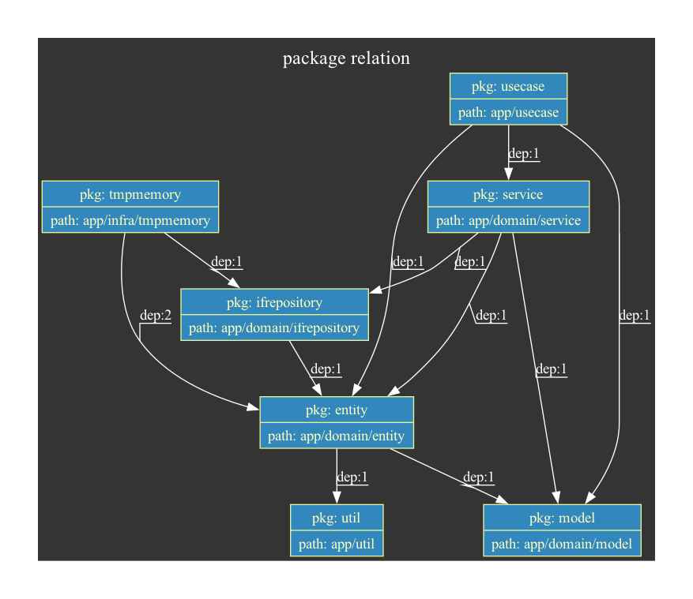
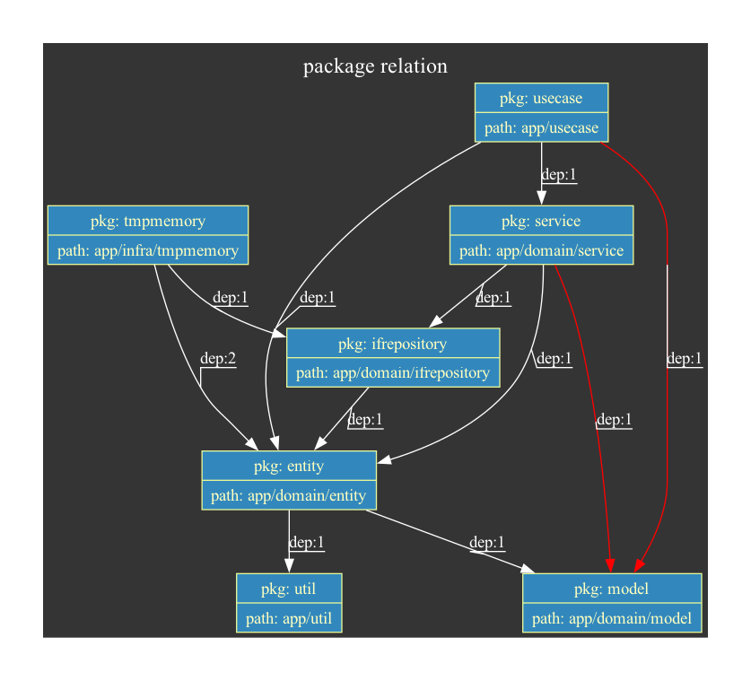
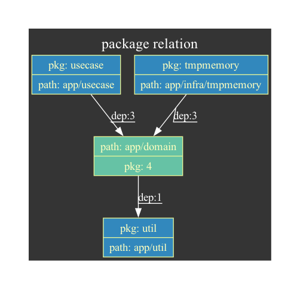
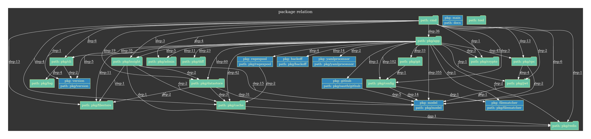
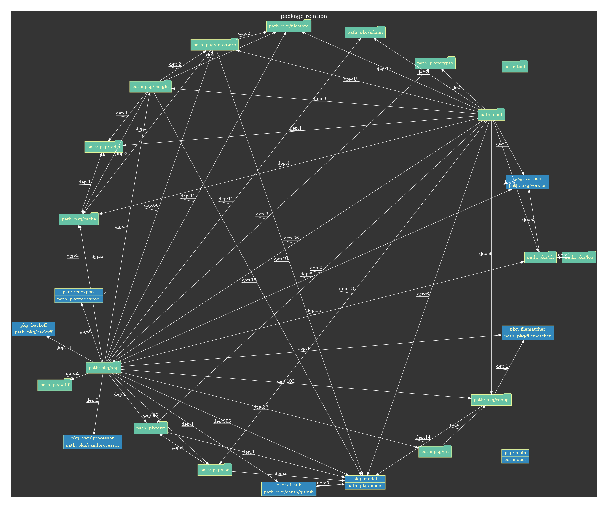

# prelviz
A vizualization tool for self custom package relation by creating dot format file.
This tool help you to understand self custom package relation and maintain project architecture.

### example1 with graphviz

- `pkg` in node indicates package name
- `path` in node indicates directory path that package exists
- `dep` indicates number of dependencies on structures, functions, etc. of the package to which the arrow points

### example2 with graphviz

- red edge color indicates architecture violation that you define

### example3 with graphviz

- folder format node indicates grouping packages

## Install

You can get `prelviz` by `go install` command.

```bash
$ go install github.com/kazdevl/prelviz/cmd/prelviz@{{version}}
```

## How to use
```bash
$ prelviz -i {{project directory path}} -o {{output file path}}
```

```bash
$ prelviz -i {{project directory path}} | dot -Tpng -o sample.png
```
NOTE: if you want to exec above usage, you need to install [graphviz](https://www.graphviz.org/).

If you want to detect architecture violation, you can set not good package relation with `.prelviz.config.json` in project directory path.
You can define `ng_relation`.
`ng_relation` has `from` and `to` fields that indicate not good package relations.
If `prelviz` detects architecture violation, the color of edges between the target packages turns red.

```json
{
    "ng_relation": [
        {
            "from": "github.com/kazdevl/sample_project/app/usecase",
            "to": ["github.com/kazdevl/sample_project/app/domain"]
        }
    ],
}
```

### Recomendation Config
If you want to use `prelviz` to the go project that have a lot of packages, you should set `grouping_directory_path` up in `.prelviz.config.json`.
`grouping_directory_path` has string array fields that indicate grouping packages with input `directory_path`.
Packages under the `directory_path` set in `grouping_directory_path` are grouped together as nodes in the dot language folder format.

example)
the sample go project
- module name: `github.com/kazdevl/sample_project`
- package list
    - `github.com/kazdevl/sample_project/app/usecase`
    - `github.com/kazdevl/sample_project/app/domain/service`
    - `github.com/kazdevl/sample_project/app/domain/repository`
    - `github.com/kazdevl/sample_project/app/domain/entity`
    - `github.com/kazdevl/sample_project/app/domain/model`
- directory path
```
.
└── app
    ├── domain
    |   ├── service
    |   |   ├── sample1.go
    |   |   └── sample2.go
    |   ├── repository
    |   |   ├── sample1.go
    |   |   └── sample2.go
    |   ├── entity
    |   |   ├── sample1.go
    |   |   └── sample2.go
    |   └── model
    |       ├── sample1.go
    |       └── sample2.go
    └── usecase
        ├── sample1.go
        └── sample2.go
```

If you want to group packages under `app/domain` in the result image of `prelviz`, specify `app/domain` in `grouping_directory_path` of `.prelviz.config.json`.

```json
{
    "ng_relation": [
        ...
    ],
    "grouping_directory_path": ["app/domain"]
}
```

### Flags
```
  -i string
        requreid: "true", description: "input project directory path"
  -l string
        requreid: "false", description: "dot layout. ex) dot, neato, fdp, sfdp, twopi, circo" (default "dot")
  -o string
        requreid: "false", description: "output file path(default is stdout)"
```

## Example
The result of using `prelviz` to [pipecd](https://github.com/pipe-cd/pipecd) with the following `.prelviz.config.json` settings.

```json
{
    "grouping_directory_path": [
        "examples",
        "pkg/admin",
        "pkg/app/helloworld",
        "pkg/app/launcher",
        "pkg/app/ops",
        "pkg/app/pipectl",
        "pkg/app/piped",
        "pkg/app/server",
        "pkg/cache",
        "pkg/cli",
        "pkg/config",
        "pkg/crypto",
        "pkg/datastore",
        "pkg/diff",
        "pkg/filestore",
        "pkg/git",
        "pkg/insight",
        "pkg/jwt",
        "pkg/log",
        "pkg/redis",
        "pkg/rpc",
        "test/integration",
        "tool"
    ]
}
```

### dot layout is `dot`


### dot layout is `circo`


## Contributing
Welcome to contribute to this project.

Fork and make a Pull Request, or create an Issue if you see any problem or any enhancement, feature request.