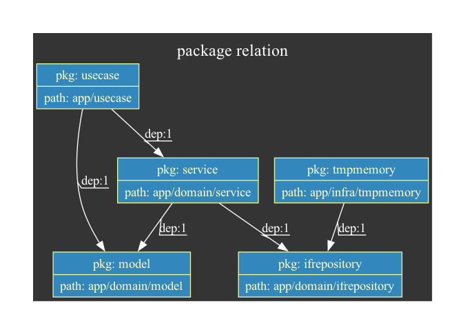
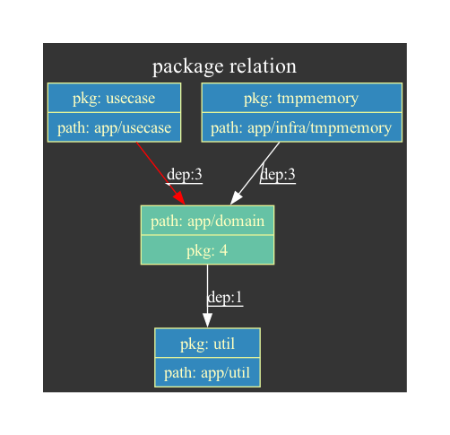
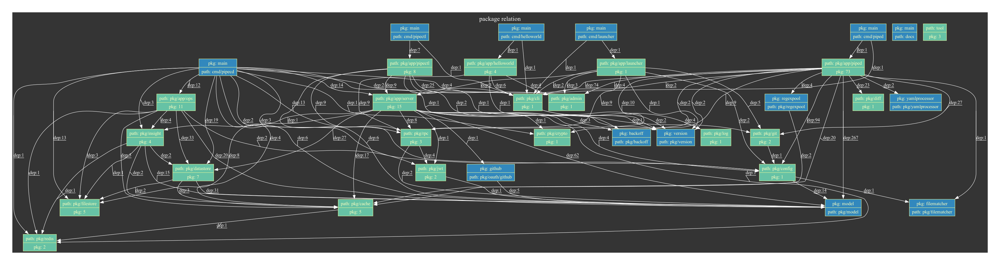

# prelviz
A **visualization tool** for **self custom package** relation by creating dot format file.
This tool help you to understand self custom package relation and maintain project architecture.


※ above image is the result of using `prelviz` to `testdata/sample_project` without config.

## Install

You can get `prelviz` by `go install` command.

```bash
$ go install github.com/kazdevl/prelviz/cmd/prelviz@v1.1.0
```
NOTE: you need go 1.21 or later.

## How to use
```bash
$ prelviz -i {{project directory path}}
```

```bash
$ prelviz -i {{project directory path}} -l {{dot layout}}
```

```bash
$ prelviz -i {{project directory path}} -o {{output file path}}
```

```bash
$ prelviz -i {{project directory path}} | dot -Tsvg -o sample.svg
```
NOTE: if you want to exec above usage, you need to install [graphviz](https://www.graphviz.org/).

### Use with config
If you want to use `prelviz` with config, you need to create `.prelviz.config.json` in project directory path.
`.prelviz.config.json` have four fields, `ng_relation`, `grouping_grouping_directory_path`, `exclude_package` and `exclude_directory_path`.

example)

```json
{
  "ng_relation": [
    {
      "from": "github.com/kazdevl/sample_project/app/usecase",
      "to": ["github.com/kazdevl/sample_project/app/domain"]
    }
  ],
  "grouping_directory_path": ["app/domain"],
  "exclude_package": [
    "github.com/kazdevl/sample_project/app/util",
    "github.com/kazdevl/sample_project/app/domain/entity"
  ],
  "exclude_directory_path": ["github.com/kazdevl/sample_project/app/exclude"]
}
```

You can set `from` and `to` value in `ng_relation` when you want to **detect dependencies that violate the project's architecture**.
When you set `from` and `to` value, you have to set package path.
If `prelviz` detects architecture violation, the color of edges between the target packages turns red.

example)


You can set `grouping_directory_path` when you want to **group packages in the result image of `prelviz`**.
When you set `grouping_directory_path` value, you have to set directory path.

example)


You can set `exclude_package` when you want to **exclude packages in the result image of `prelviz`**.
When you set `exclude_package` value, you have to set package path.

example)



You can set `exclude_directory_path` when you want to **exclude packages in target directoies in the result image of `prelviz`**.
When you set `exclude_directory_path` value, you have to set directory path.

### Point
The values in `grouping_directory_path` are treated as package, so it must also be considered when setting `ng_relation`.

example)

the sample go project
- module name: `github.com/kazdevl/sample_project`
- package list
  - `github.com/kazdevl/sample_project/app/usecase`
  - `github.com/kazdevl/sample_project/app/domain/service`
  - `github.com/kazdevl/sample_project/app/domain/repository`
  - `github.com/kazdevl/sample_project/app/domain/entity`
  - `github.com/kazdevl/sample_project/app/domain/model`
- directory path
```
.
└── app
    ├── domain
    |   ├── service
    |   |   ├── sample1.go
    |   |   └── sample2.go
    |   ├── repository
    |   |   ├── sample1.go
    |   |   └── sample2.go
    |   ├── entity
    |   |   ├── sample1.go
    |   |   └── sample2.go
    |   └── model
    |       ├── sample1.go
    |       └── sample2.go
    └── usecase
        ├── sample1.go
        └── sample2.go
```
- config before setting `grouping_directory_path`
```json
{
  "ng_relation": [
    {
      "from": "github.com/kazdevl/sample_project/app/usecase",
      "to": ["github.com/kazdevl/sample_project/app/domain/model"]
    }
  ]
}
```

In the above situation, when setting the `grouping_directory_path`, you need to modify the config as follows
```json
{
  "ng_relation": [
    {
      "from": "github.com/kazdevl/sample_project/app/usecase",
      "to": ["github.com/kazdevl/sample_project/app/domain"]
    }
  ],
  "grouping_directory_path": ["app/domain"]
}
```
`to` value is `github.com/kazdevl/sample_project/app/domain`, not `github.com/kazdevl/sample_project/app/domain/model`.



### Recomendation
If you try to use `prelviz` to the go project that have a lot of packages, it is recommended to set `grouping_directory_path` and `exclude_directory_path` in `.prelviz.config.json`.
Otherwise, when the output is converted to an image, the number of elements is too large and visibility is catastrophic.

### Flags
```
  -i string
        requreid: "true", description: "input project directory path"
  -l string
        requreid: "false", description: "dot layout. ex) dot, neato, fdp, sfdp, twopi, circo" (default "dot")
  -o string
        requreid: "false", description: "output file path(default is stdout)"
```

## Prelviz Image Description
- color of node indicates node type
  - `blue`: package
  - `green`: directory
- color of edge indicates dependency type
  - `white`: default
  - `red`: architecture violation
- `pkg` in blue node indicates package name
- `pkg` in green node indicates the number of packages under the node
- `path` in blue node indicates directory path that package exists
- `path` in green node indicates directory path
- `dep` on edge indicates number of dependencies on structures, functions, etc. of the package to which the arrow points

## Example
The result of using `prelviz` to [pipecd](https://github.com/pipe-cd/pipecd) with the following `.prelviz.config.json` settings.

```json
{
    "grouping_directory_path": [
        "examples",
        "pkg/admin",
        "pkg/app/helloworld",
        "pkg/app/launcher",
        "pkg/app/ops",
        "pkg/app/pipectl",
        "pkg/app/piped",
        "pkg/app/server",
        "pkg/cache",
        "pkg/cli",
        "pkg/config",
        "pkg/crypto",
        "pkg/datastore",
        "pkg/diff",
        "pkg/filestore",
        "pkg/git",
        "pkg/insight",
        "pkg/jwt",
        "pkg/log",
        "pkg/redis",
        "pkg/rpc",
        "test/integration",
        "tool"
    ]
}
```

### dot layout is `dot`


### dot layout is `circo`


## Contributing
Welcome to contribute to this project.

Fork and make a Pull Request, or create an Issue if you see any problem or any enhancement, feature request.